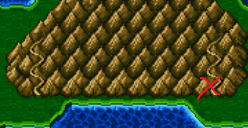
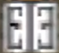
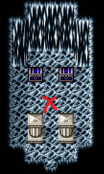

| location            | boss              | sprite                               | Location Image                             | notes               |
| ------------------- | ----------------- | ------------------------------------ | ------------------------------------------ | ------------------- |
| Mist Cave           | D. Mist           |          |              |                     |
| Kaipo Inn           | Officer & Soldiers|        |               | After burning Mist  |
| Sandruby Turn In    | Waterhag          |        |               | ?                   |
| Waterfall           | Octomamm          |        |           |                     |
| Antlion Cave        | Antlion           |         |             |                     |
| Mt. Hobbs           | Mombomb           |         |            |                     |
| Fabul               | Gauntlet          |        |               | Heal before & after |
| Mt. Ordeals 1       | Milon             |      |        |                     |
| Mt. Ordeals 2       | Milon Z           |      |        | Back attack         |
| Mt. Ordeals 3       | Dark Knight cecil |             |        | Heal after          |
| Baron Inn 1         | Guard x2          |      |           | Triggers back to back fight |
| Baron Inn 2         | Yang              |            |           | Heal after          |
| Baron Castle 1      | Baigan            |       |             |                     |
| Baron Castle 2      | Kainazzo          |        |             |                     |
| Baron Castle 3      | Odin              |            |             |                     |
| Cave Magnes         | Dark Elf          |        |         | Forced loss, then full heal before |
| Tower of Zot 1      | Magus Sisters     |   |               |                     |
| Tower of Zot 2      | Valvalis          |        |               | Heal before         |
| Dwarf Castle 1      | Calbrena          |        |        |                     |
| Dwarf Castle 2      | Golbez            |          |        |                     |
| Hook Route 1        | Eblans            |         |        |                     |
| Hook Route 2        | Rubicante         |       |        | Heal before         |
| Tower Key           | Dark Imp x3       |         |           |                     |
| Tower Boss          | Dr. Lugae         |           |          |                     |
| Sealed Cave         | Evil Wall         |        |         | Grab item first     |
| Feymarch King       | Leviatan          |        |       |                     |
| Feymarch Queen      | Asura             |           |      |                     |
| Giant of Bab-Il 1   | Elements          |       |             |                     |
| Giant of Bab-Il 2   | CPU               |             |             |                     |
| Cave Bahamut        | Bahamut           |         |        |                     |
| Murasame altar      | Pale Dim          |         |      |                     |
| Crystal Sword altar | Wyvern            |         | |                     |
| White Spear altar   | Plague            |         |   |                     |
| Ribbon room         | D. Lunar          |         |         |                     |
| masamune altar      | Ogopogo           |         |      |                     |
